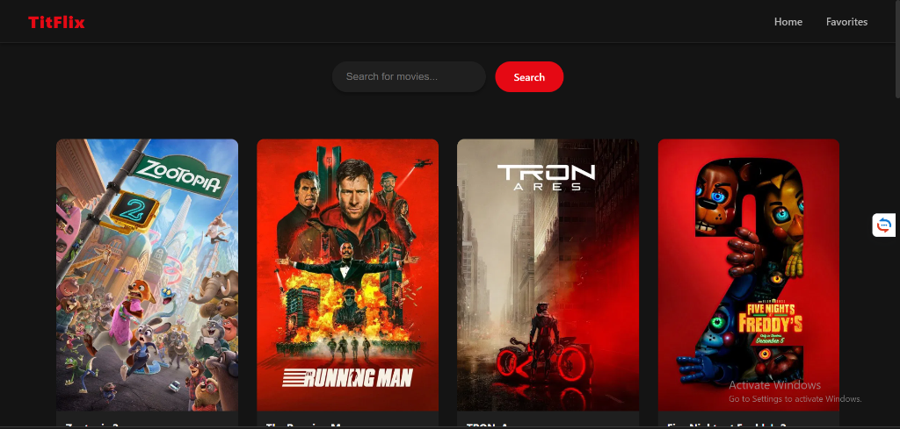

# TitFlix - Modern Movie App

A premium, modern movie application built with **React**, **TypeScript**, and **Vite**.



## Features

- **Modern UI**: Glassmorphism navbar, dark cinematic mode, and responsive design.
- **Discover Movies**: Browse popular movies with high-quality posters.
- **Search**: Real-time search functionality to find your favorite films.
- **Favorites**: flexible favorites system persisted locally. save your top picks!
- **Tech Stack**:
  - React 19
  - TypeScript
  - Movie Database API (TMDB)
  - CSS3 (Variables, Grid, Flexbox)

## Getting Started

1. **Clone the repository**
   ```bash
   git clone <your-repo-url>
   ```

2. **Install dependencies**
   ```bash
   npm install
   ```

3. **Run the development server**
   ```bash
   npm run dev
   ```

4. **Build for production**
   ```bash
   npm run build
   ```

## License

MIT
